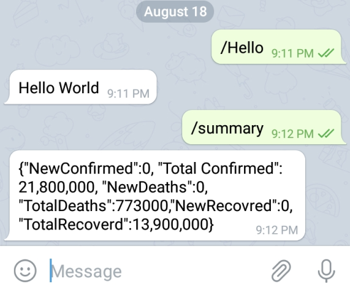

# COVID-19 Telegram Bot with Python

COVID-19 Telegram Bot built using Python that fetches real-time Global COVID-19 statistics using the COVID19API. By sending the command /summary in Telegram, users instantly receive global confirmed cases, deaths, and recovered statistics.

---

## 📌 Features
- Gets real-time global COVID-19 data
- Simple /summary command
- Clean and reusable Python code
- Uses requests and JSON
- Built using python-telegram-bot library

---

## 🛠️ Technologies Used
- Python
- python-telegram-bot
- Requests
- JSON
- COVID19 API

---

## 🚀 How the Bot Works
The bot sends a request to:
api.covid19api.com
It receives live COVID-19 summary data in JSON format, extracts the Global statistics, and sends it as a Telegram message.

---

## ✅ Steps to Setup Telegram Bot
1️⃣ Open Telegram  
2️⃣ Search **BotFather**  
3️⃣ Run `/start`  
4️⃣ Run `/newbot`  
5️⃣ Give bot name  
6️⃣ Give bot username  
7️⃣ Copy the **Bot Token**

Replace it inside `main.py`
updater = Updater("YOUR_TELEGRAM_BOT_TOKEN", use_context=True)

---

## ▶️ How to Run the Project

### Install Dependencies
pip install -r requirements.txt

### Run the Bot
python main.py

Go to Telegram and type:
/summary

You will get live Global COVID-19 report.

---

## 📸 Application Screenshot

---

## 🔁 Reusability
- Can be modified to show country-wise data
- Can be extended to show vaccination stats
- You can integrate with dashboards

---

## 🤝 Contribution
Pull requests are welcome. Feel free to fork and enhance.
